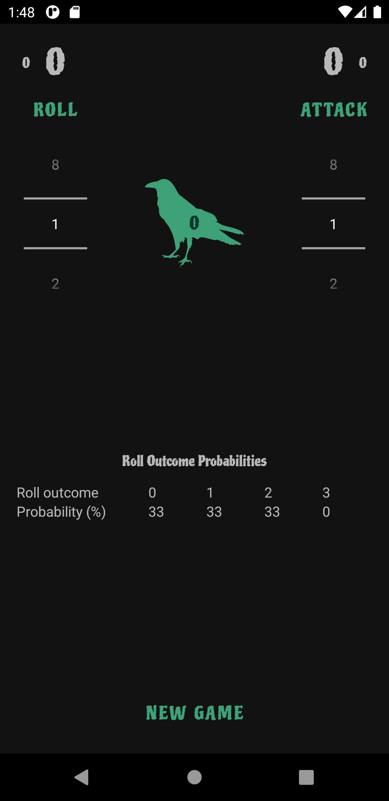
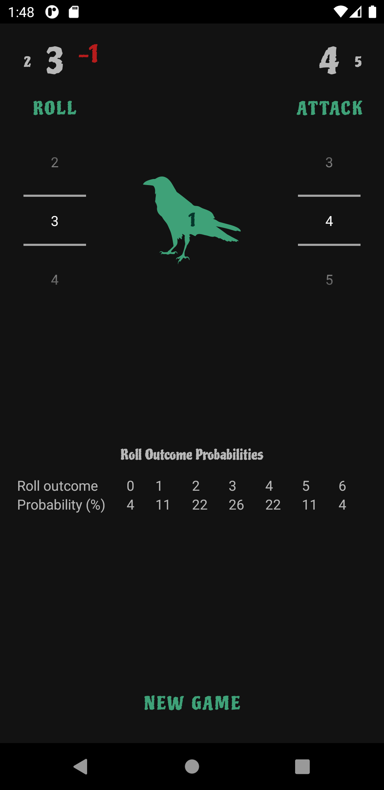
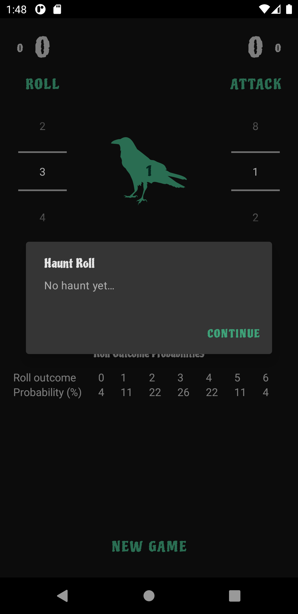
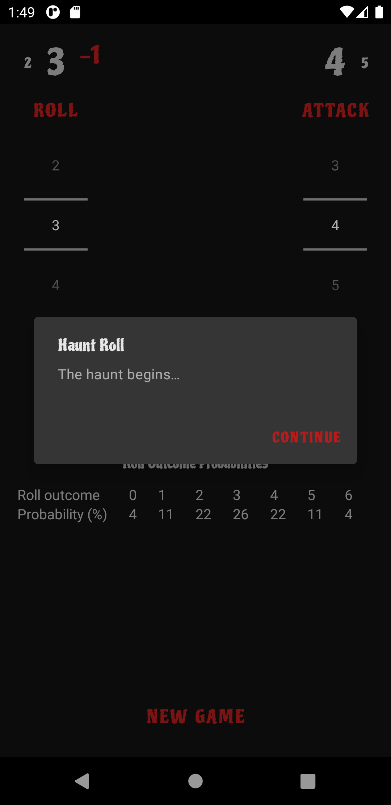

# BetrayalDice
An Android app that replaces the dice in Betrayal at House on the Hill.

# Screenshots
See the probability of your desired roll outcome in the "Outcome Outcome Probabilities" table.

Use the attack button instead of doing basic arithmetic.

Save your mental math skills for another time, just tap the crow to complete the haunt roll.

The interface will change when the haunt begins.

